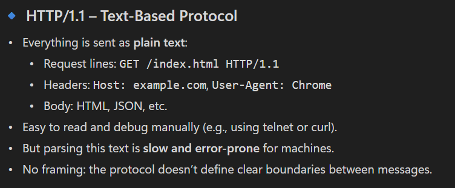
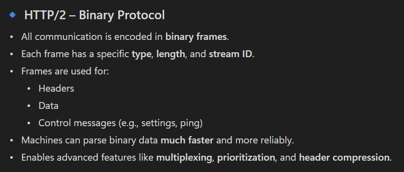
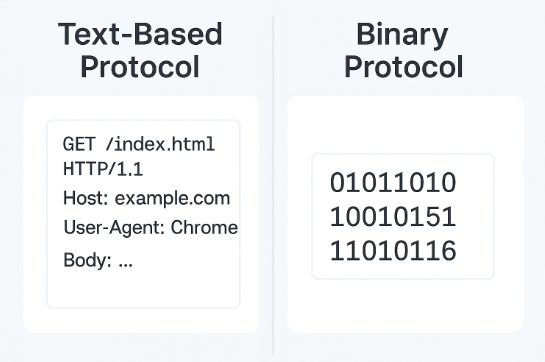
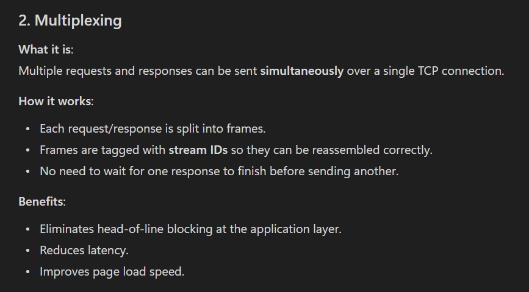
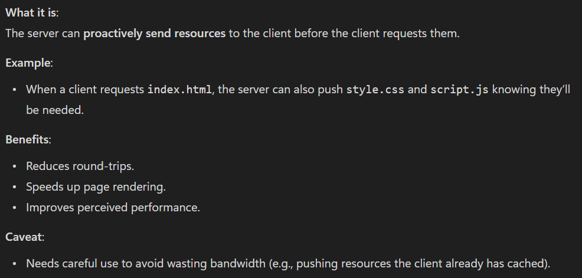
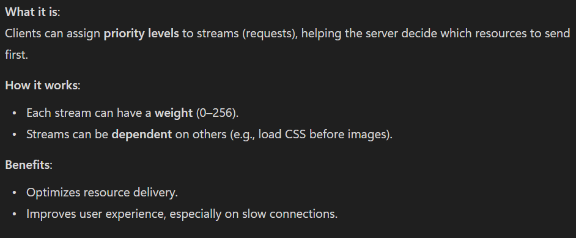
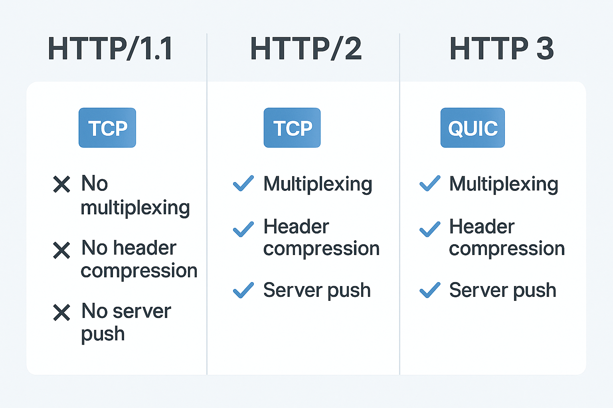

# Getting started
1. Read the **Introduction to HTTPS** document ([here](../../Introduction%20to%20SSL.docx)) to get started.
2. In this document, we see a 10,000 ft view of what HTTP is, problems with it, and how HTTPS solves these problems.
    - We also talk about what symmetric and asymmetric encryption is, approaches to using them in the real world.

# Basic networking terms to know
## HTTP
1. **HTTP/1.1 (1997)** - Key Features:
   - Text-based protocol: Easy to read and debug.
        - 
   - Persistent connections: Reuses TCP connections for multiple requests.
        - Introduced in HTTP/1.1, persistent connections allow multiple HTTP requests/responses to be sent over a single TCP connection without reopening it each time.
        - Benefits:
            - Reduces latency from connection setup.
            - Saves resources by avoiding repeated handshakes.
            - Enables keep-alive behavior.
        - Limitations:
            - Still suffers from HoL blocking.
            - Doesn’t support true multiplexing (unlike HTTP/2).
   - Pipelining (optional): Allows multiple requests without waiting for responses, but rarely used due to head-of-line blocking.
   - **Limitations:**
        - **Head-of-line blocking:** One slow response blocks others.
            - In HTTP/1.1, even though multiple requests can be sent over a single TCP connection (thanks to persistent connections), responses must be returned in order.
            - If one response is slow, it blocks all subsequent responses—even if those are ready.
            - Example:
                - Imagine you request three resources: A, B, and C. If A takes a long time to process, B and C are stuck waiting, even if they’re quick.
        - **Multiple TCP connections:** Browsers open several connections to improve performance, which is inefficient.
            - To work around HoL blocking, browsers open multiple TCP connections (usually 6 per domain) to parallelize requests.
            - **Problems** with this approach:
                - TCP handshake overhead: Each connection needs a 3-way handshake.
                - TLS handshake overhead: If HTTPS is used, each connection also needs a TLS handshake.
                - Resource-heavy: More connections mean more memory and CPU usage on both client and server.
                - Congestion control inefficiency: Each connection manages congestion separately, which can lead to suboptimal throughput.
        - **No compression of headers:** Large headers slow down communication.
2. **HTTP/2 (2015)** - Key Improvements:
   - Binary protocol: More efficient and less error-prone than text.
        - 
        - 
   - Multiplexing: Multiple requests/responses over a single TCP connection without blocking.
        - 
   - Header compression (HPACK): Reduces overhead.
   - Server push: Server can send resources proactively.
        - 
   - Stream prioritization: Allows clients to prioritize resources.
        - 
   - **Limitations:**
        - Still uses TCP, so suffers from head-of-line blocking at the transport layer (especially over lossy networks).
3. **HTTP/3 (2022)** - Major Shift:
    - Built on QUIC (Quick UDP Internet Connections), a transport protocol developed by Google.
    - UDP-based: Avoids TCP’s head-of-line blocking.
    - Faster connection setup: QUIC combines TLS and transport handshake.
    - Improved performance on mobile and lossy networks.
    - Connection migration: Seamless switching between networks (e.g., Wi-Fi to mobile data).
    - **Benefits**:
        - Lower latency.
        - Better performance under poor network conditions.
        - More secure and efficient.
4. 

## Internet protocol (IP)
1. IPV4 and IPV6

## Wireshark
1. This is a network analysis tool that helps you analyze the network traffic